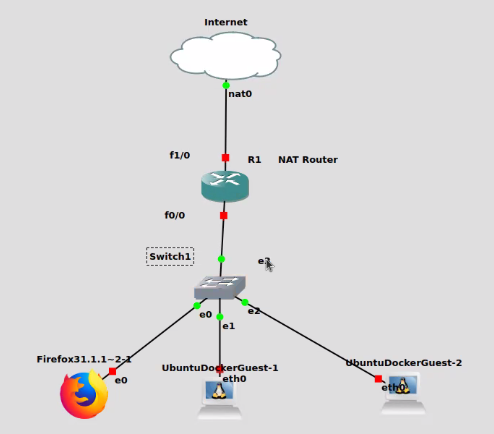
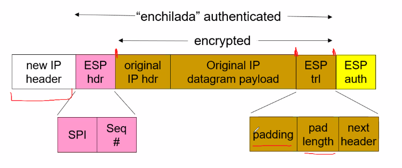
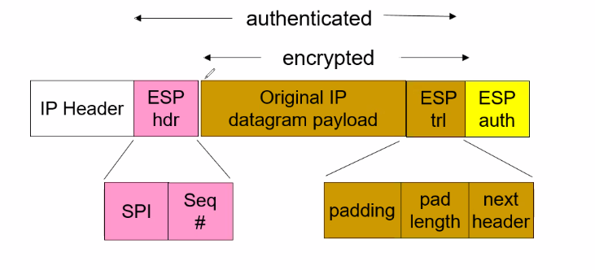
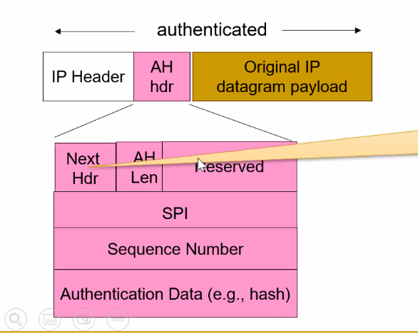
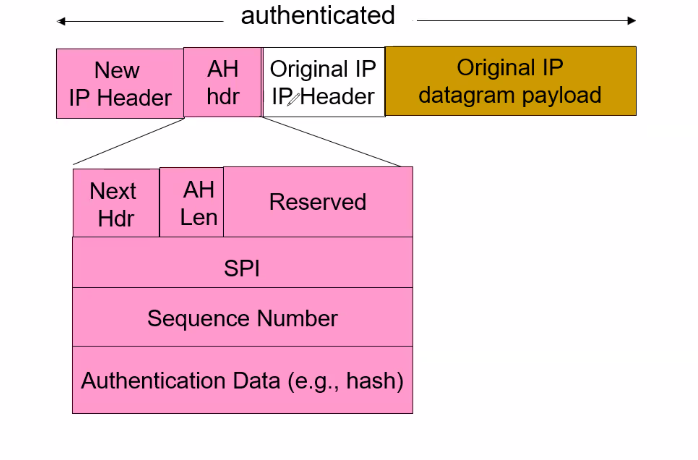

## Final Exam Review Sheet

# IPv6 and NAT

1. Explain what NAT stands for and how it is used in networking. Give some examples of its practical applications and how to solve problems involving NAT.
    NAT - Network Address Translation, method of remapping one IP address space into another by modifying network address information in the IP header of packets while they are in transit across a traffic routing device. 

2. Discuss the pros and cons of NAT for network performance, securitym and scalability
    Pros - allows to extend the life of IPv4, allows to hide internal network structure, allows to use private IP addresses, allows to use one public IP address for multiple devices, Can add some overhead since packets are rewritten

    Cons - Limited to 60,000 connections (2 ^ 16), routers should only process packets up to layer 3, violates end-to-end principle, address shortage should instead be solved by IPv6

3. Compare and constrast the different techniques for NAT traversal. How do they work and when are they used?
    [TODO]

4. Describe the differences between the IPv4 and IPv6 protocols and their packet structures. What are the advantages and disadvantages of IPv6?
    IPv6 inital motivation: 32bit address space of IPv4 is not enough, IPv6 has 128bit address space

    IPv6 Removes: checksum, options, header length, fragmentation

5. Demonstrate your understanding of IPv6 tunneling by explaining how it works and why it is needed.
    Tunneling - IPv6 datagram carried as a payload in IPv4 datagram among IPv4 routers

    Tunneling is needed because IPv6 is not widely deployed, so IPv6 packets must be encapsulated in IPv4 packets to be sent across the internet

6. Be able to configure NAT in a Cisco router.

R1 - Nat Router

    config t
    interface f1/0
    ip address dhcp
    no shutdown

    config t
    interface f0/0
    ip address 10.0.0.1 255.255.255.0
    no shutdown

    interface f1/0
    ip nat outside

    interface f0/0
    ip nat inside
    ip nat inside source list 1 interface f1/0 overload
    access-list 1 permit 10.0.0.0 0.0.0.255 
    ip route 0.0.0.0 0.0.0.0 192.168.122.1

Ubuntu Docker Guest

    Uncomment static ip 
    address: 10.0.0.3
    netmask: 255.255.255.0
    gateway: 10.0.0.1

Now should be able to ping router gateway and nat cloud node

# Firewalling

1. What is a firewall?
    A firewall is a network security device that monitors incoming and outgoing network traffic and decides whether to allow or block specific traffic based on a defined set of security rules.

2. According to NIST SP 800-41, what are the characteristics of a firewall?
    1. IP Address Filtering: controls access based on IP address (e.g., source, destination, or both)
    2. Application Protocols: controls access based on application protocol data contained in the message (e.g., HTTP, FTP, Telnet, etc.)
    3. User Identification: controls access based on user identification (e.g., user name, password, etc.)
    4. Network Activity: controls access based on network activity characteristics (time of day, etc.)

3. What are the limitations of a firewall?
    Capabilties:
        - Define a traffic choke point in the network and protects against IP spoofing and routing attacks
        - Provide a location for monitoring the security events
        - Provide non-security functions: logging intenet usage, netwoork address translation, etc.
        - Serve as a platform for VPN/IPsec
    
    Limitations:
        - Cannot protect against attacks that bypass the firewall
        - Cannot protect against internal threats
        - Cannot protect against wireless connections between systems on the different sides of the firewall

4. What is a packet filter firewall? Be able to write and interpret rules and spot configuration flaws.
    Packet Filtering Firewall: applies a set of tules to each packet based on the packet headers

    Filter based on:
        - Source IP address
        - Destination IP address
        - IP Protocol 
        - Interface 

    When no rule matches, the default rule is applied
        - Default deny: drop the packet
        - Default allow: forward the packet

5. What is the difference between the default allow and default deny firewall policies? Which one is more secure?
    Default deny is more secure because it drops the packet when no rule matches

6. Be able to configure the packet filtering functions of iptables
    iptables --list: list all rules
    INPUT: incoming packets
    OUTPUT: outgoing packets
    FORWARD: packets that are neither incoming nor outgoing

    Example: Write iptables rules to block all ICMP traffic to and from the system
        iptables -A INPUT -p icmp -j DROP 
        iptables -A OUTPUT -p icmp -j DROP

    Example: Write iptables rules to block all traffic on port 22
        iptables -A OUTPUT -p tcp --dport 22 -j DROP
        iptables -A OUTPUT -p tcp --sport 22 -j DROP

    Exmaple: Write iptables rules to block traffic to host 192.168.2.2
        iptables -A OUTPUT -p tcp -d 192.168.2.2 -j DROP
        iptables -A OUTPUT -p tcp -s 192.168.2.2 -j DROP

7. What are the limitations of the packet filter firewall?
    Limitations:
        - Does not examine upper layer protocols (e.g., HTTP, FTP, etc.)
        - Cannot support advanced user authentication (inability to examine application data)
        - Can be fooled by IP address spoofing
        - Prone to misconfiguration (easy to make mistakes)
        - Source routing attacks (attacker can specify the route that the packet should take)
    
8. What is the stateful firewall and how does it compare to a packet filter?
    Stateful Firewall: can examine packets in the context of the connections of which they are a part of

    Stateful firewalls maintain a directory of inbound/outbound connections and can determine whether a packet is part of an existing connection (State table)

    Stateful firewalls can:
        - Block packets that do not match an existing connection
        - Block packets that match an existing connection but do not match the state of the connection
        - Allow packets that match an existing connection and match the state of the connection

9. What is the application-level firewall? What are its advantages and limitations?
    Application-level firewall/gateway: Operates at the application layer, and examines application-layer data

10. What is a circuit-level firewall? What are its advantages and limitations?

11. What are the different approaches to basing the firewall?

12. What are the host-based firewalls?

13. What are the network device firewalls?

14. What are virtual firewalls?

15. What is the DMZ? How is it used for securing networks?

16. What are the advantages and disadvantages of having the two DMZ firewalls be from different vendors?

17. Be able to write pfSense firewall rules.

# VPN and IPsec

1. What is a VPN? What are the practical applications of the VPN?
    Virtual Private Network - connects computers and LANs securely over an unsecure network using encryption and protocols
        - Provides encryption and authentication

2. What services does IPsec provide?
    IPsec provides:
        - Data integrity (prevents tampering)
        - Origin authentication (prevents spoofing)
        - Replay attack protection (prevents replay attacks)
        - Confidentiality (prevents eavesdropping / encryption)

3. What is the difference between the IPsec authentication header (AH) and the IPsec encapsulating security payload (ESP)? Be able to describe the services and differences between the two.
    AH - Authentication Header: provides authentication and integrity DOES NOT provide confidentiality
        - Verifies packets have not been tampered with or spoofed by using message digest algorithms and a shared secret key
        - If message digest does not match, packet is dropped
    ESP - Encapsulating Security Payload: provides authentication, integrity, and confidentiality
        - Protects the confidentiality of the packet by using symmetric encryption algorithms and a shared secret key
        - Can also provide authentication and integrity by using message digest algorithms and a shared secret key similar to AH

4. Be able to identify scenarios where AH and ESP would be optimal.
    - AH is useful when encryption is not needed or allowed, but authentication and integrity are needed
    - ESP is useful when encryption is needed or preferred, and authentication and integrity are OPTIONAL or desired

5. Explain how IPsec works in the AH and ESP mode. How do they differ in terms of security and performance?
    AH Mode - Only authentication and integrity (Lower overhead due to no encryption)
    ESP - Authentication, Integrity, and Encryption (Higher overhead due to encryption)

6. Evaluate the possibility and implications of using AH and ESP modes together in IPsec. What are the benefits and drawbacks of this approach?
    One of the benefits of using AH and ESP together is that it provides authentication, integrity, and encryption. However, this approach has a higher overhead due to the encryption.
        Processing packets with AH and ESP together is more expensive than processing packets with AH or ESP alone.
        More complex to implement and configure

7. What is the difference between IPsec transport mode and tunnel mode?
    Transport Mode: only the payload of the IP packet is encrypted and/or authenticated
    Tunnel Mode: the entire IP packet is encrypted and/or authenticated

    End routers are the only ones that can process packets in transport mode
    Intermediate routers can process packets in tunnel mode

8. Understand all IPsec packet structures.
    ESP Mode Tunnel Mode:
        - New IP header: contains the source and destination IP addresses of the tunnel endpoints
        - ESP header: contains the SPI and sequence number
            - SPI - Security Policy Index: 32 bit number for the SA of the packet, receiver uses SPI, destination, and IPsec mode to determine which SA to use
            - Sequence number - used to prevent replay attacks
        - ESP trailer: contains the padding, pad length, next header
        - ESP authentication: contains the authentication data (digest)

    ESP Mode Transport Mode: Original IP header is NOT encrypted
        - ESP header: contains the SPI and sequence number
        - ESP trailer: contains the padding, pad length, next header
        - ESP authentication: contains the authentication data (digest)

    AH Mode Transport Mode:  Original IP header is NOT encrypted
        - AH header: contains the SPI, sequence number, authentication data (digest)
        - Original IP header: contains the source and destination IP addresses

    AH Mode Tunnel Mode: 
        - New IP header: contains the source and destination IP addresses of the tunnel endpoints
        - AH header: contains the SPI, sequence number, authentication data (digest)
        - Original IP header: contains the source and destination IP addresses

9. Explain how IPsec defends against replay attacks.
    IPsec defends against replay attacks by using sequence numbers in the ESP header. The sequence number is incremented for each packet sent, and the receiver checks the sequence number to make sure it is not a replay attack.
        - Sliding window: receiver keeps track of the last N sequence numbers, and if the sequence number is not in the window, the packet is dropped

10. What is the IPsec security association (SA)? What is it used for?
    IPsec Security Association: a one-way relationship between two parties that defines how to secure traffic between them
        - Contains the security parameters for the connection
        - Contains the SPI, encryption algorithm, authentication algorithm, and keys

11. Are SA's simplex, half-duplex, or full-duplex?
    SA's are simplex, meaning that two SA's are needed for a full-duplex connection
    Each router must have an SA for incoming and outgoing traffic

12. What is the IPsec security policy?
    IPsec Security Policy: set of rules that determine whether or not a packet is subject to IPsec processing
        - Contains the source and destination IP addresses, IPsec mode, and IPsec protocol (AH or ESP)
    IPsec policy can be configured by the network administrator or automatically by the IPsec implementation

13. What is the security policy database (SPD)?
    Security Policy Database: contains the IPsec security policies, and is used to determine whether or not a packet is subject to IPsec processing
        - Contains the source and destination IP addresses, IPsec mode, and IPsec protocol (AH or ESP)
        - Contains the action to take if a packet matches the policy (e.g., discard, bypass, protect)
        - Contains the security parameters index (SPI) to use for the packet

14. What is the security association database (SAD)?
    Security Association Database: contains the IPsec security associations, and is used to process incoming and outgoing packets
        - Contains the SPI, encryption algorithm, authentication algorithm, and keys
        - Contains the source and destination IP addresses, IPsec mode, and IPsec protocol (AH or ESP)

15. Explain how SPD and SAD are used to process incoming and outgoing packets.
    Incoming packets:
        - Packet is received
        - SPD is checked to see if the packet matches an IPsec policy
        - If the packet matches an IPsec policy, the SAD is checked to see if there is an SA for the packet
        - If there is an SA for the packet, the packet is processed according to the SA
        - If there is no SA for the packet, the packet is dropped
        - If the packet does not match an IPsec policy, the packet is processed according to the SPD

    Outgoing packets:
        - Packet is received
        - SPD is checked to see if the packet matches an IPsec policy
        - If the packet matches an IPsec policy, the SAD is checked to see if there is an SA for the packet
        - If there is an SA for the packet, the packet is processed according to the SA
        - If there is no SA for the packet, the packet is dropped
        - If the packet does not match an IPsec policy, the packet is processed according to the SPD

16. Be able to explain the two phases of the Internet Key Exchange (IKE) protocol.
    Internet Key Exchange Protocol: used to establish IPsec tunnel, consist of two phases
        - Phase 1 
            - Two peers establish an IKE phase 1 tunnel also known as the bi-directional IKE Security Association or (ISAKMP)
            - IKE phase 1 tunnel is used to protect IKE phase 2 tunnel
            - Phase 1 tunnel is only used for management traffic such as negotiating the parameters for the phase 2 tunnel
            - Phase 1 tunnel is not used to protect user data
        - Phase 2
            - Two peers establish an IKE phase 2 tunnel also known as the uni-directional IPsec Security Association
            - Phase 2 tunnel is used to protect user data
            - Phase 2 tunnel is not used for management traffic

17. What is the difference between IKE's PSK and PKI modes?
    PSK - Pre-Shared Key: uses a shared secret key to authenticate the peers
    PKI - Public Key Infrastructure: uses public key certificates to authenticate the peers

18. Be able to compare IPsec to SSL/TLS.
        SSL is in application; IPsec is OS
            - IPsec protects all apps in the upper layers
            - SSL protects only the app that uses it

        SSL is susceptible to a DoS attack; IPsec is not
            - SSL is susceptible to a DoS attack because the SSL handshake is computationally expensive
            - IPsec is not susceptible to a DoS attack because the IKE handshake is not computationally expensive

19. Be able to recognize misconfigurations in Cisco router IPsec. You will not be asked to explicitly perform a full IPsec configuration, but you should be able to recognize misconfigurations.

# Penetration Testing

# Intrusion Deteection/Logging/Monitoring

1. What is intrusion detection?
    Intrusion Detection: 
        Host-Based IDS/IPS: monitor single host act, access to more information, but can be less secure since it is on the host

        Network-Based IDS/IPS: monitor network traffic, only see network traffic, but can be more secure since it is not on the host but can not see host activity

    Logical Components:
        Sensors: collect data
        Analyzers: determine if intrusion has occurred
        User Interface: display data

2. What is intrusion prevention(IPS)?
    Intrusion Prevention System: monitors network traffic and takes action to prevent intrusions

3. How can IDS/IPS help cope with insider threats?

4. What is the difference between host-based and network based intrusion detection systems?

5. What are the components of the IDS?

6. What is the difference between IDS false positives and false negatives?
    False Positive: Normal activity is flagged as malicious
    False Negative: Malicious activity is not flagged as malicious

7. What are the requirements of the IDS system?
    Requirements:
        - Run continually
        - Be fault tolerant
        - Resist subversion
        - Impose a minimal overhead on system resources
        - Configured according to system policies
        - Adapt to changes in system and users
        - Scale to monitor large numbers of systems
        - Provide a graceful degradation of service
        - Allow dynamic reconfiguration

8. What are audit records? What is the difference between the native audit records and detection-specific audit records?
    Audit Records: records that are generated by the system
    Native audit records: records that are generated by the OS
    Detection-specific audit records: records that are generated by the IDS
        - Additional overhead but specific to the IDS
        - Often log individual elementary actions

9. What is signature and rule-based detection?
    Signature-Based IDS: detects intrusions by comparing current activity to known malicious activity
        - Pattern matching: compares current activity to a database of known malicious activity
        - Stateful matching: compares current activity to a database of known malicious activity, but also keeps track of the state of the connection
    Rule-based anomaly detection:
        - Analyze historical audit records for expected behavior, then match with current behavior
    Rule-based penetration detection:
        - Rules identify known penetrations
        - Often by analyzing attack scripts
        - Supplemented with rules from security experts

10. What is an anomaly-based IDS?
    Anomaly-Based IDS: detects intrusions by comparing current activity to normal activity
        - Threshold-based: compares current activity to a threshold
            - Checks excessive event occurrences over time
            - Alone a crude and ineffective method intruder detector
            - Must determine both threshold and time period
        - Profile-based: compares current activity to a profile
            - Gather metrics: count, gauge, interval timer, resource utilization
            - Analyze: mean and standard deviation 

11. What are the advantages and disadvantages of the active (IPS) and passive (IDS) modes?
    Passive mode or IDS: Monitors network traffic only
        - Does not affect performance of network traffic
        - Can be incapable of sending on network
    Active mode or IPS: Performs inline processing of packets
        - Causes penalty in performance
        - Must be capable of sending on network

12. What are the limitations of the IDS?
    IDS can NOT stop intrusions, only detect them

13. What are the different approaches for connecting an IDS?
    Switch Port Analyzer (SPAN) aka Port Mirroring: allows a network sniffer to monitor TX/RX/Both transmission between two ports
        - Can be used to connect IDS to network
        - Can be used to connect IDS to switch
    Hub: Repeats all traffic to all nodes
        - Disadvantage: throughput limitations since all nodes share same physical link - cannot implement duplex transmission
        - Advantage: Easy to install and configure

14. What is the distributed Host-based IDS?
    Distributed Host-Based IDS: multiple IDS sensors are deployed on multiple hosts
        - Sensors send data to a central analyzer
        - Analyzer correlates data from multiple sensors
        - Analyzer can detect intrusions that span multiple hosts

15. Explain how Host-based IDS work.
    Host-Based IDS: monitors activity on a single host
        - Can monitor more information than network-based IDS
        - Can be less secure since it is on the host

16. Where can network-based IDS sensors be deployed?
    Network-based IDS sensors can be deployed:
        - On a network segment
        - On a network device
        - On a host

17. What are honeypots? What are they used for?
    Honeypots: decoy systems 
        - filled with fake data
        - instrumented with monitors / event loggers
        - divert and hold attacker to collect information
        - without exposing real systems

18. What are the different ways to deploy honeypots?
    Honeypots can be deployed on a network or on a host

19. What is snort? 
    Snort: open source, lightweight, network-based IDS
        - Real-time packet capture and rule-based analysis
        - Passive or inline operation (IPS)
        - Packet -> Decoder -> Detection Engine -> Output Modules
        - Can be configured to detect a wide variety of attacks